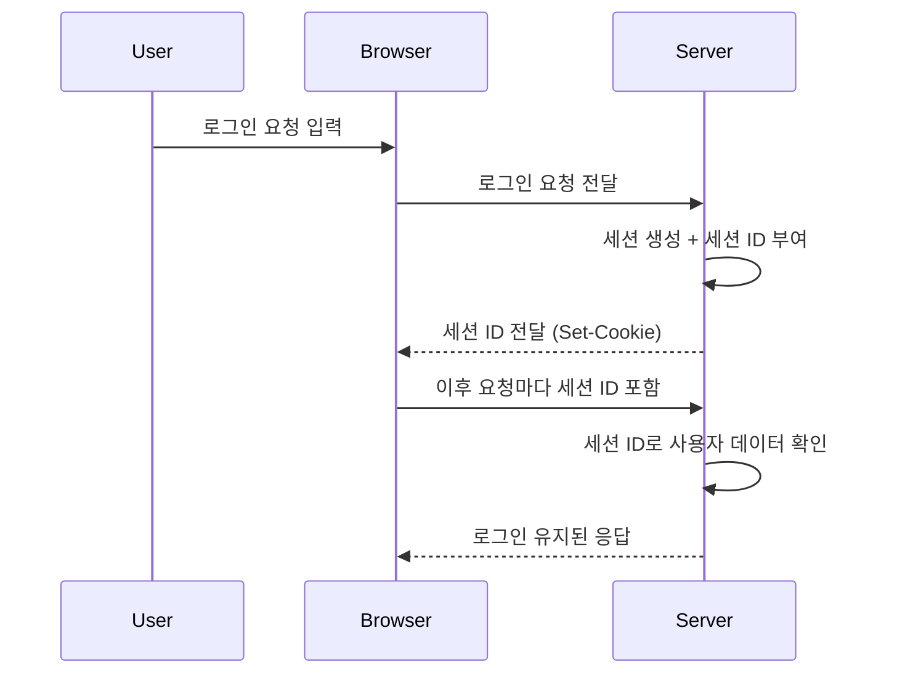

# 세션(Session)과 쿠키(Cookie)의 차이

웹 애플리케이션을 개발하다 보면, **사용자의 상태를 어떻게 유지할까?** 하는 문제가 반드시 등장합니다.  
HTTP 프로토콜은 기본적으로 **무상태(stateless)** 이기 때문에, 요청마다 사용자를 새롭게 인식합니다.  
이때 사용자의 상태를 유지하는 대표적인 방법이 바로 **쿠키(Cookie)** 와 **세션(Session)** 입니다.

---

## 📌 1. 쿠키(Cookie)란?

쿠키는 **클라이언트(브라우저)에 저장되는 작은 데이터 조각**입니다.  
주로 key=value 형태로 저장되며, 서버가 응답할 때 `Set-Cookie` 헤더를 통해 브라우저에 전달됩니다.

### 🔹 쿠키의 특징

- 저장 위치: 클라이언트(브라우저)
    
- 용량 제한: 보통 4KB 내외
    
- 자동 전송: 같은 도메인 요청 시 브라우저가 자동으로 포함
    
- 지속성: 만료일을 지정하면 브라우저 종료 후에도 유지 가능
    

### 🔹 쿠키 사용 예시

- 아이디 자동 입력
    
- 다크모드/언어 설정 유지
    
- 장바구니 임시 저장
    

```http
HTTP/1.1 200 OK
Set-Cookie: theme=dark; Expires=Wed, 23 Aug 2025 23:59:59 GMT; Path=/; HttpOnly
```

다음 요청부터는 브라우저가 자동으로 `Cookie` 헤더에 담아 서버에 전달합니다.

```http
GET /mypage HTTP/1.1
Host: example.com
Cookie: theme=dark
```

---

## 📌 2. 세션(Session)이란?

세션은 **서버에서 관리하는 사용자 상태 정보**입니다.  
클라이언트에는 단순히 세션을 식별할 수 있는 **세션 ID**만 전달되고, 실제 데이터는 서버에서 관리합니다.

### 🔹 세션의 특징

- 저장 위치: 서버 (메모리, DB, Redis 등)
    
- 클라이언트에는 세션 ID만 저장 (보통 쿠키에 저장됨)
    
- 브라우저 종료 시 세션 만료 (기본 설정)
    
- 보안성이 쿠키보다 상대적으로 높음
    

### 🔹 세션 동작 흐름 (Mermaid 다이어그램)



---

## 📌 3. 쿠키와 세션의 차이

|구분|쿠키 (Cookie)|세션 (Session)|
|---|---|---|
|저장 위치|클라이언트(브라우저)|서버|
|보안|상대적으로 취약 (노출 가능)|비교적 안전 (서버 관리)|
|용량 제한|4KB 정도|서버 메모리/DB 용량 제한|
|속도|빠름 (클라이언트에서 즉시 읽기)|상대적으로 느림 (서버 접근 필요)|
|지속 시간|만료일 지정 시 브라우저 닫아도 유지|브라우저 종료 시 기본적으로 삭제됨|
|사용 목적|단순 데이터 저장 (설정, UI 상태 등)|중요한 정보 관리 (로그인, 권한 관리 등)|

---

## 📌 4. 로그인 예제 시나리오

### 🔹 쿠키 기반 로그인

1. 사용자가 로그인하면 서버가 사용자 정보를 암호화하여 쿠키에 저장.
    
2. 이후 요청 시 쿠키를 자동 전송.
    
3. 서버는 쿠키에 담긴 정보를 읽어 인증 수행.
    

⚠️ 문제점: 쿠키 자체에 사용자 정보가 들어 있기 때문에 탈취 시 위험.

### 🔹 세션 기반 로그인

1. 사용자가 로그인하면 서버는 세션 생성 후 세션 ID 발급.
    
2. 브라우저는 세션 ID만 쿠키에 저장.
    
3. 이후 요청 시 세션 ID를 전달.
    
4. 서버는 세션 저장소에서 사용자 상태를 확인 후 인증.
    

✅ 장점: 쿠키에는 세션 ID만 있으므로 보안성이 더 높음.

---

## 📌 5. 쿠키와 세션을 함께 쓰는 경우

실무에서는 **쿠키와 세션을 함께 조합**하여 사용합니다.

- 세션 ID를 쿠키에 저장 (대표적)
    
- 토큰 기반 인증(JWT)에서도 Access Token을 쿠키에 저장 가능
    
- 사용자 경험 개선: 세션은 로그인 상태 관리, 쿠키는 UI 환경 저장
    

---

## 📌 6. 보안 관련 고려사항

- **쿠키 보안 옵션**
    
    - `HttpOnly`: 자바스크립트로 접근 불가 (XSS 방어)
        
    - `Secure`: HTTPS 연결에서만 전송
        
    - `SameSite`: 크로스 사이트 요청 제한 (CSRF 방어)
        
- **세션 보안**
    
    - 세션 고정 공격(Session Fixation) 방어: 로그인 시 세션 재발급
        
    - 세션 하이재킹 방어: 세션 ID를 자주 갱신
        
    - 서버 자원 관리: 세션 만료 시간 설정 필수
        

---

## 📌 7. 언제 쿠키를 쓰고, 언제 세션을 쓸까?

- **쿠키 사용에 적합한 경우**
    
    - 비민감한 데이터 저장 (테마, 언어 설정)
        
    - 페이지 뷰 카운트, 방문 이력 추적
        
- **세션 사용에 적합한 경우**
    
    - 로그인 상태 유지
        
    - 사용자 권한/역할 관리
        
    - 민감 데이터 관리
        

---

## 📌 8. 핵심 요약

1. **쿠키**는 브라우저에 저장되는 작은 데이터 조각 → "사용자 로컬 메모"
    
2. **세션**은 서버에서 관리하는 사용자 상태 → "서버 캐비닛 + 열쇠는 쿠키에"
    
3. 로그인/보안이 필요한 경우는 세션, 간단한 설정은 쿠키가 적합
    

---

## 📌 9. 참고 자료

- [MDN Web Docs - Cookies](https://developer.mozilla.org/ko/docs/Web/HTTP/Cookies)
    
- [MDN Web Docs - Sessions](https://developer.mozilla.org/en-US/docs/Web/HTTP/Session)
    
- [OWASP - Session Management](https://owasp.org/www-project-cheat-sheets/cheatsheets/Session_Management_Cheat_Sheet.html)
    

---

## ✍️ 마무리

쿠키와 세션은 웹 개발에서 **사용자 상태를 유지하는 핵심 개념**입니다.  
보안, 성능, 사용자 경험을 종합적으로 고려해 **상황에 맞는 방식을 선택**하는 것이 중요합니다.

> 다음 포스팅에서는 **JWT와 세션 기반 인증의 차이**를 다루며, 현대적인 인증 방식으로 어떻게 발전했는지 알아보겠습니다.
