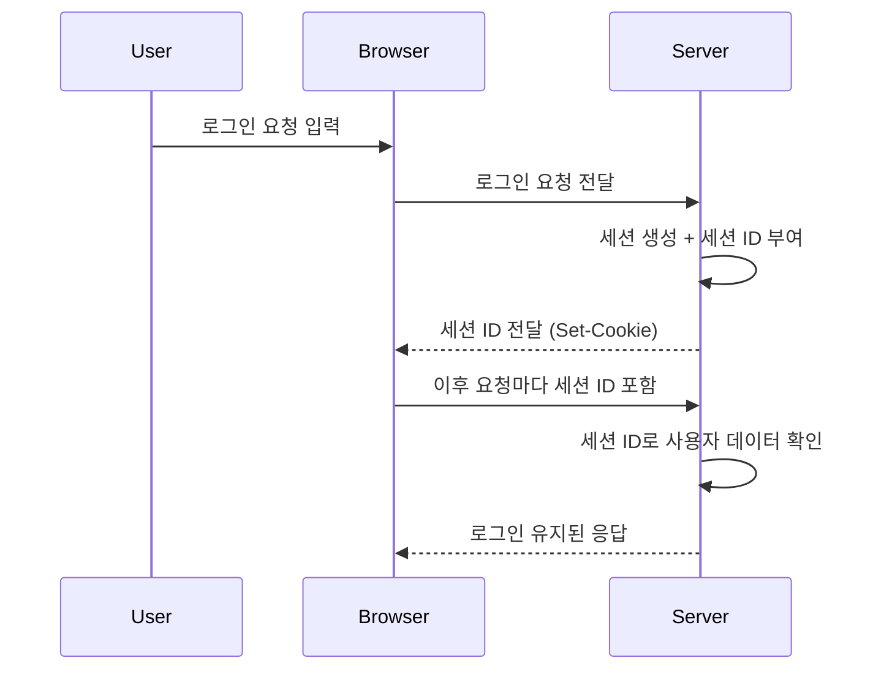

## 세션(Session)과 쿠키(Cookie)의 차이
---
웹 애플리케이션을 개발하다 보면, "사용자의 상태를 어떻게 유지할까?" 하는 문제가 반드시 등장합니다.  HTTP 프로토콜은 기본적으로 **무상태(stateless)** 이기 때문에, 요청마다 사용자를 새롭게 인식합니다. 

이때 사용자의 상태를 유지하는 대표적인 방법이 바로  **쿠키(Cookie)** 와 **세션(Session)** 입니다.

<br>

## 쿠키(Cookie)란?
---
쿠키는 이용자가 웹사이트를 열람하는 동안 해당 웹사이트가 전달되어 이용자의 웹 브라우저를 통해 그의 PC에 저장하는 매우 작은 크기의 텍스트 (.txt)파일입니다.

또한 웹 사이트에 사용자에 대한 정보를 제공하여 웹 사이트에서 사용자 경험을 맞춤화하는 데 도움이 됩니다. 예를 들어, 전자 상거래 웹 사이트에서는 쿠키를 사용하여 사용자가 장바구니에 어떤 상품을 담았는지 파악합니다. 또한 인증 쿠키와 같이 보안을 위해 필요한 쿠키도 있습니다. 일반적으로는 사용자의 로그인 정보를 저장하여 사용자의 편의를 보장하는데 많이 사용됩니다.


쿠키[^1]

<br>

### 쿠키의 목적
---

#### 세션 관리(Session management)
---
쿠키는 웹 사이트 활동을 **특정 사용자와 연결**하는 데 도움이 됩니다.세션 쿠키에는 사용자 세션과 해당 사용자의 관련 데이터 및 콘텐츠를 일치시키는 고유 문자열(문자와 숫자의 조합)이 포함되어 있습니다.

웹 사이트 홈페이지에서 사용자는 자신의 계정에 로그인합니다. 그럼 사용자에 대한 HTTP 요청이 웹 사이트로 전송되면 요청에 로그인 한 사용자의 세션 쿠키가 포함됩니다. 웹 사이트에 이 쿠키가 있으므로 사용자가 인식되고 새 페이지가 로드될 때 다시 로그인할 필요가 없습니다.

<br>

#### 개인화(Personalization)
---
쿠키가 웹 사이트에서 사용자 행동 또는 사용자 기본 설정이 "기억"되는 데 도움이 되므로 웹 사이트에서 사용자 경험이 맞춤화될 수 있습니다.

사용자가 쇼핑 웹 사이트에서 로그아웃하면 사용자 이름이 쿠키에 저장되어 웹 브라우저로 전송될 수 있습니다. 다음에 해당 웹 사이트를 로드할 때 웹 브라우저에서는 이 쿠키가 웹 서버로 전송되고, 웹 서버에는 지난번에 사용한 사용자 이름으로 **로그인**하라는 메시지가 표시됩니다. 또한 사용자의 **선호목록**, **설정된 테마** 등이 세팅됩니다.

<br>

#### 트래킹(Tracking)
---
일부 쿠키에는 사용자가 방문한 웹 사이트가 기록됩니다.이 정보는 다음에 브라우저가 해당 서버에서 콘텐츠를 로드할 때 쿠키를 생성한 서버로 전송됩니다.타사 추적 쿠키를 사용하면 브라우저가 해당 추적 서비스를 사용하는 웹 사이트를 로드할 때마다 이 프로세스가 수행됩니다.

사용자가 이전에 추적 쿠키를 전송한 웹 사이트를 방문한 적이 있는 경우, 이 추적 서비스를 사용하는 웹 사이트를 로드할 때 맞춤형 광고가 표시될 수 있습니다.

그러나 쿠키를 추적하는 데 광고만이 사용되는 것은 아닙니다.또한 많은 분석 서비스에서 추적 쿠키를 사용하여 익명으로 사용자 활동을 기록합니다.

<br>

### 쿠키의 특징
---
- 저장 위치: 클라이언트(브라우저)
    
- 용량 제한: 보통 4KB 내외
    
- 자동 전송: 같은 도메인 요청 시 브라우저가 자동으로 포함
    
- 지속성: 만료일을 지정하면 브라우저 종료 후에도 유지 가능

<br>

### 사용 예시
---
```http
HTTP/1.1 200 OK
Set-Cookie: theme=dark; Expires=Wed, 23 Aug 2025 23:59:59 GMT; Path=/; HttpOnly
```

다음 요청부터는 브라우저가 자동으로 `Cookie` 헤더에 담아 서버에 전달합니다.

```http
GET /mypage HTTP/1.1
Host: example.com
Cookie: theme=dark
```


쿠키의 취약성[^1]

<br>

## 세션(Session)이란?
---
세션(session)이란 웹 사이트의 여러 페이지에 걸쳐 사용되는 사용자 정보를 저장하는 방법을 의미합니다. 사용자가 브라우저를 닫아 서버와의 연결을 끝내는 시점까지를 세션이라고 합니다.

앞서 살펴본 쿠키는 클라이언트 측의 컴퓨터에 모든 데이터를 저장합니다. 하지만 세션은 서비스가 돌아가는 서버 측에 데이터를 저장하고, 실제 데이터가 아닌 세션의 키값만을 클라이언트 측에 남겨둡니다. 브라우저는 필요할 때마다 이 키값을 이용하여 서버에 저장된 데이터를 사용하게 됩니다.

 이러한 세션은 보안에 취약한 쿠키를 보완해주는 역할을 하고 있습니다.


세션[^2]

<br>

### 세션의 동작방식
---
#### 세션 생성

- 사용자가 로그인하면 서버는 고유한 세션 ID를 생성
- 세션 ID는 UUID와 같이 예측할 수 없는 값으로 생성
- 서버는 이 세션ID를 키(key)로 하고, 사용자 정보를 값(value)으로 하는 세션을 저장소에 저장

#### 세션 유지

- 서버는 생성된 세션ID를 클라이언트에게 쿠기를 통해 전달.
- 클라이언트는 이후 요청 시마다 이 쿠키(세션ID)를 서버에 전송.

#### 세션 확인

- 서버는 요청에서 전달된 세션ID를 확인하고, 세션 저장소에서 해당 세션을 조회
- 세션이 유효하면 사용자 정보를 가져와 인증 및 인가를 처리

#### 세션 종료

- 로그아웃하거나 세션이 만료되면 서버는 해당 세션을 삭제
- 클라이언트의 쿠키에 저장된 세션ID는 더 이상 유효하지 않음

<br>

### 세션의 특징
---

- 저장 위치: 서버 (메모리, DB, Redis 등)
    
- 클라이언트에는 세션 ID만 저장 (보통 쿠키에 저장됨)
    
- 브라우저 종료 시 세션 만료 (기본 설정)
    
- 보안성이 쿠키보다 상대적으로 높음
    

<br>
### 세션 동작흐름
---



세션의 취약성[^2]

<br>

## 쿠키와 세션의 차이
---

| 구분    | 쿠키 (Cookie)             | 세션 (Session)             |
| ----- | ----------------------- | ------------------------ |
| 저장 위치 | 클라이언트(브라우저)             | 서버                       |
| 보안    | 상대적으로 취약 (노출 가능)        | 비교적 안전 (서버 관리)           |
| 용량 제한 | 4KB 정도                  | 서버 메모리/DB 용량 제한          |
| 속도    | 빠름 (클라이언트에서 즉시 읽기)      | 상대적으로 느림 (서버 접근 필요)      |
| 지속 시간 | 만료일 지정 시 브라우저 닫아도 유지    | 브라우저 종료 시 기본적으로 삭제됨      |
| 사용 목적 | 단순 데이터 저장 (설정, UI 상태 등) | 중요한 정보 관리 (로그인, 권한 관리 등) |

<br>

## 쿠키와 세션의 사용 용도
---

### 쿠키 사용에 적합한 경우
---
- 비민감한 데이터 저장 (테마, 언어 설정)
	
- 페이지 뷰 카운트, 방문 이력 추적

<br>

### 세션 사용에 적합한 경우
---
- 로그인 상태 유지
	
- 사용자 권한/역할 관리
	
- 민감 데이터 관리

<br>

## <i class="fa-solid fa-notes-medical"></i> 추천 게시물
---
- [HTTP란 무엇인가?](https://bangjeongbin.github.io/TIL-Blog/posts/what-is-http)

<br>

## Reference
---
- [tcpschool.com](https://tcpschool.com)
- [MDN Web Docs](https://developer.mozilla.org/ko/)
- [Cloudflare Learning Center](https://www.cloudflare.com/ko-kr/learning/)
- [세션(Session)이란?](https://velog.io/@jangut600/%EC%84%B8%EC%85%98Session%EC%9D%B4%EB%9E%80)

[^1]: 출처 : https://raonctf.com/essential/study/web/cookie_connection
[^2]: 출처 : https://raonctf.com/essential/study/web/session_connection
